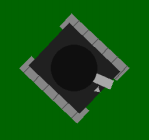
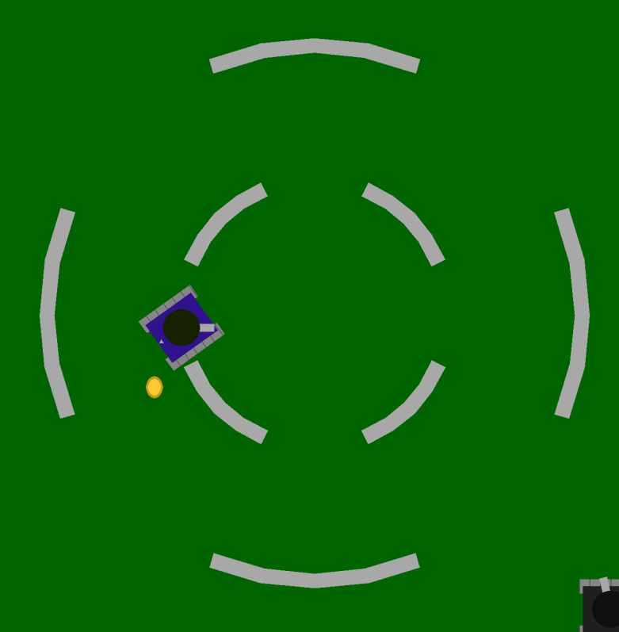
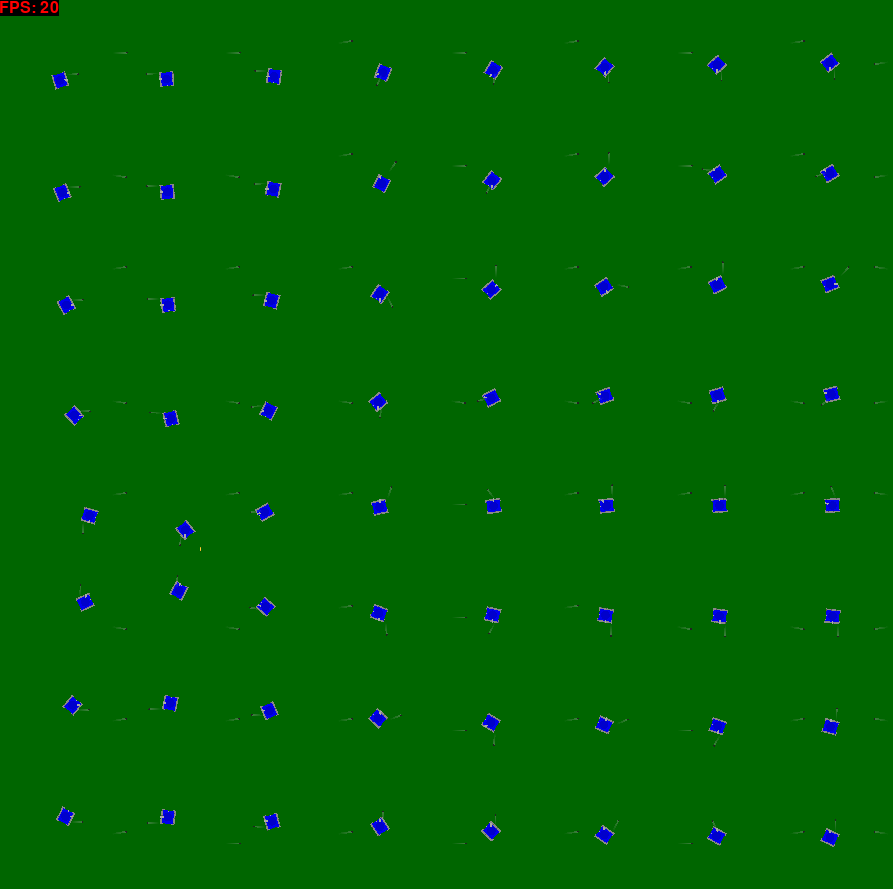
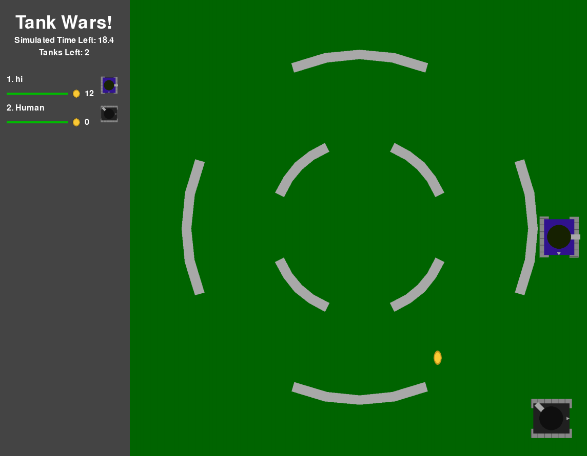

# Background

During the hack night, your goal is to program a tank to kill other tanks and collect coins.

All teams' tanks will be placed in a massive 1v1 tournament bracket, where seeding is determined by a battle royale round.

## Tank

Tanks consist of a chassis and a turret.

The chassis can turn clockwise or counter-clockwise, and it can move forwards or backwards relative to its rotation.

The turret can turn clockwise or counter-clockwise *independently* of the chassis, and it can shoot bullets in the direction it faces.

## Coin

Coins are collectable by tanks. The number of coins that a tank collects serves as a tiebreaker in case multiple tanks are alive at the end of simulation.

There is only one coin on the map at a given time; this is to encourage tanks to encounter each other.

## Map

There are two maps: the one vs. one map and the the battle royale map. 

### One vs. One Map

This map contains two concentric sets of circular walls, with one spawn location in the top-left and one spawn location in the bottom-right. It's small in size, which is enough to support two tanks.

### Battle Royale Map

This map is a blank map that is large in size, with 64 spawn locations evenly dispersed around the field.

Similar to a battle royale game, the walls will converge inwards like a "zone", forcing tanks into closer proximity.

## Game

This is what the game interface looks like

## General Rules

1. When a bullet collides into an opposing tank, it deals that tank 10% of its health.

2. When a tank runs out of health, it dies.

3. One versus one matchups have a one minute time limit, while battle royale matchups have a three minute time limit.

4. If a matchup ends without a clear winner (i.e. one tank left alive), then we tiebreak firstly on number of coins collected, and secondly on the remaining health.

5. In the case of a battle royale matchup, the winner earns the 1 seed for the tournament, while the remaining tanks are seeded based on time of death firstly (where later deaths are better), number of coins secondly, and remaining health thirdly.
